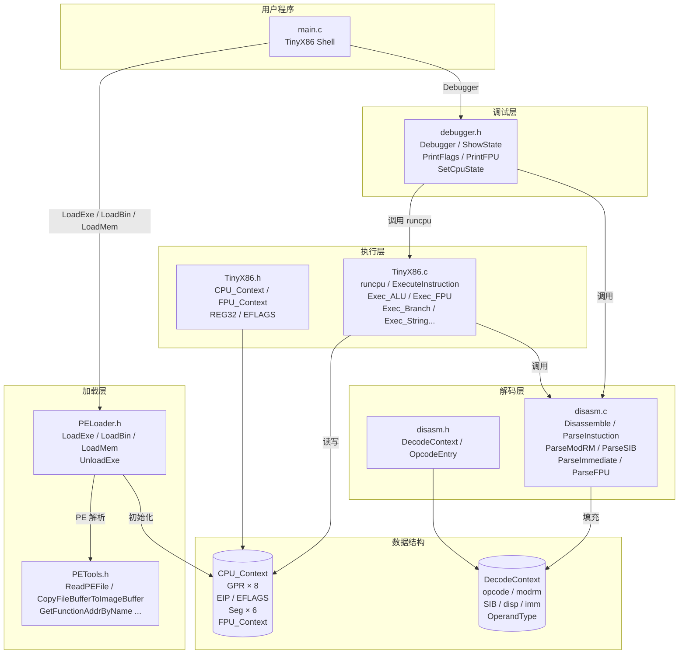
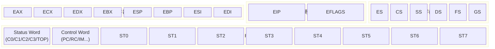
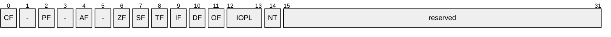
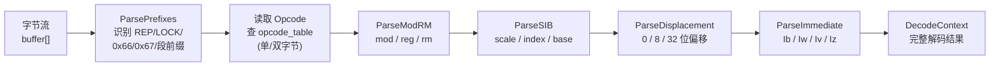
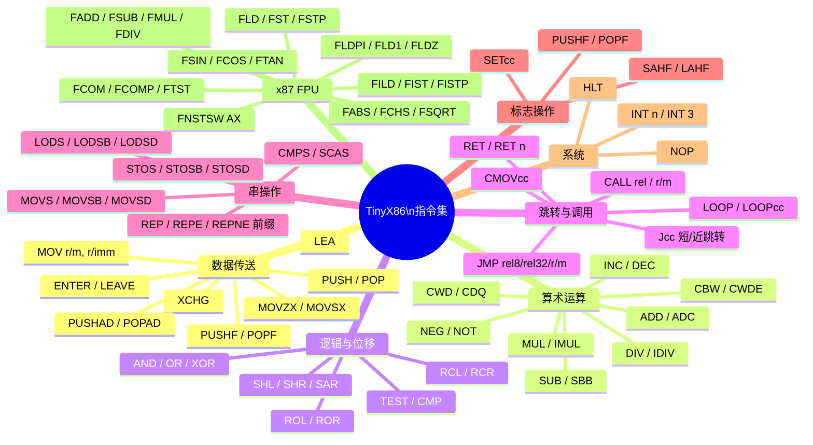
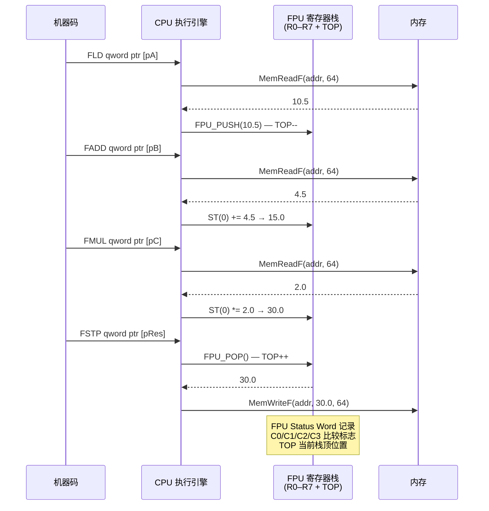

# TinyX86

一个轻量级的 x86（IA-32）CPU 模拟器，用纯 C 实现，包含完整的指令解码器与执行引擎、x87 FPU 浮点运算、PE 可执行文件加载器以及交互式调试器。

---

## 目录

- [项目简介](#项目简介)
  - [宿主内存方案：进程内模拟执行 (In-Process Emulation)](#宿主内存方案进程内模拟执行-in-process-emulation)
- [模块架构](#模块架构)
- [CPU 寄存器布局](#cpu-寄存器布局)
- [指令解码流水线](#指令解码流水线)
- [指令执行流程](#指令执行流程)
- [支持的指令集](#支持的指令集)
- [FPU 子系统](#fpu-子系统)
- [快速上手](#快速上手)
- [调试器](#调试器)
- [测试](#测试)
- [文件结构](#文件结构)
- [未来计划 (Roadmap)](#未来计划-roadmap)

---

## 项目简介

TinyX86 是一个教学/研究用途的 x86-32 CPU 模拟器，核心由四大模块组成：

| 模块 | 文件 | 职责 |
|------|------|------|
| 解码器 (Disassembler) | `disasm.c` / `disasm.h` | 从字节流中解析 x86 指令，填充 `DecodeContext` |
| 执行引擎 (Executor) | `TinyX86.c` / `TinyX86.h` | 根据 `DecodeContext` 执行指令，更新 `CPU_Context` |
| 加载器 (Loader) | `PELoader.c` / `PELoader.h` | 加载 PE 可执行文件或原始二进制到模拟内存 |
| 调试器 (Debugger) | `debugger.c` / `debugger.h` | 交互式调试循环，支持单步、断点、反汇编、内存查看 |

### 宿主内存方案：进程内模拟执行 (In-Process Emulation)

TinyX86 当前采用的是**宿主内存方案**，侧重于**快速执行**与**辅助调试**。  
在逆向工程领域，这种方式被称为 **"In-Process Emulation"（进程内模拟执行）**——模拟器与宿主进程共享同一地址空间，无需建立独立的沙箱虚拟地址映射。

#### 逆向工程典型用途

| 场景 | 说明 |
|------|------|
| **算法还原 / 去混淆** | 遇到被混淆（obfuscated）的代码（如 VMProtect 处理函数），只需将那块内存喂给 TinyX86，让它在同一进程内跑一遍，直接读取寄存器结果，速度极快。 |
| **脱壳（Unpacking）** | 模拟执行壳的解密代码。由于与宿主处于同一地址空间，可轻松调用原程序的 `GetProcAddress` 等 API，无需任何额外桥接。 |
| **API 挂钩（Hooking）** | 如果被模拟代码调用 `MessageBox`，因地址空间相同，模拟器可以直接跳转执行系统真实的 `MessageBox`，实现零成本 API 透传或拦截。 |
| **指令 Trace 插件** | 类似 OllyDbg / x64dbg 的 Trace 功能，对目标代码进行逐指令追踪记录，输出执行轨迹供后续分析。 |

> **结论：** 如果目标是做一个轻量级的**算法还原工具**、**辅助脱壳脚本**，或**指令 Trace 插件**，当前的宿主内存方案更好——它简单、直接、性能高。

---

## 模块架构



---

## CPU 寄存器布局



### EFLAGS 标志位



---

## 指令解码流水线



---

## 指令执行流程


---

## 支持的指令集



---

## FPU 子系统

x87 FPU 采用 8 个物理寄存器（R0–R7）加一个栈顶指针 TOP 实现寄存器栈。



---

## 快速上手

### 编译（Windows / MSVC）

使用 Visual Studio 打开 `TinyX86.slnx`，直接生成即可。

### 交互式 Shell

运行程序后进入交互式 Shell：

```
TinyX86 Emulator [Sprint 13]
Type 'h' for help.

(Shell) > h

========== TinyX86 Shell ==========
 [e]xe  <path> : Load PE Executable
 [b]in  <path> : Load Raw Binary
 [t]est        : Run Internal Test (Sum 1..10)
 [h]elp        : Show Menu
 [q]uit        : Exit
===================================
```

| 命令 | 说明 |
|------|------|
| `e <path>` | 加载 32 位 PE 可执行文件（支持拖拽路径）|
| `b <path>` | 以原始二进制方式加载文件（基址 0x400000）|
| `t` | 运行内置测试（递归 power 函数演示）|
| `h` | 显示帮助菜单 |
| `q` | 退出程序 |

加载成功后自动进入调试器，退出调试器后返回主菜单。

### 核心 API

#### 加载器接口（PELoader.h）

| 函数 | 说明 |
|------|------|
| `LoadExe(filepath, ctx)` | 加载 32 位 PE 可执行文件，自动映射到正确基址 |
| `LoadBin(filepath, ctx, baseAddr)` | 加载原始二进制文件到指定基址 |
| `LoadMem(code, size, ctx, baseAddr)` | 将内存中的机器码映射到指定基址 |
| `UnloadExe(ctx)` | 释放已加载的代码与栈内存 |

#### 执行引擎接口（TinyX86.h）

| 函数 | 说明 |
|------|------|
| `runcpu(ctx, step)` | 执行 `step` 条指令，返回 0 成功 |
| `ExecuteInstruction(ctx, d_ctx)` | 执行单条已解码指令 |
| `ReadGPR(ctx, index, size)` | 读通用寄存器（8/16/32 位）|
| `WriteGPR(ctx, index, size, val)` | 写通用寄存器 |
| `GetEffectiveAddress(ctx, d_ctx)` | 计算有效地址 |
| `GetOperandValue(ctx, d_ctx, idx)` | 读操作数值 |
| `SetOperandValue(ctx, d_ctx, idx, val)` | 写操作数值 |
| `MemRead(addr, bytes)` | 读内存（1/2/4 字节）|
| `MemWrite(addr, val, bytes)` | 写内存 |
| `UpdateEFLAGS(ctx, res, dst, src, size, op)` | 更新标志位 |

---

## 调试器

加载成功后自动进入交互式调试器（`debugger.c`）。

```
=== TinyX86 Debugger Initialized ===
Type 'h' for help.

(0x00401000)  push ebp                        ; Next
(dbg) > h

--- Command Help ---
 Execution:
  s [N]     : Step Into (execute N instructions, default 1)
  n         : Step Over (skip CALL/LOOP/REP... instructions)
  c         : Continue (run until breakpoint or halt)
  q         : Quit debugger (halt CPU)
 Breakpoints:
  b <addr>  : Set Breakpoint at hex address (e.g., b 401005)
  bl        : List all Breakpoints
  bc        : Clear all Breakpoints
 Inspection:
  r         : Show all Registers (GPR, Flags, FPU)
  u [N]     : Disassemble next N instructions (default 5)
  m <addr>  : Dump memory at hex address (64 bytes)
  k [N]     : Dump Stack (show N dwords around ESP, default 8)
 Modification:
  w <reg> <val> : Write Register (e.g., w EAX 1234, w ZF 1)
  e <addr> <val>... : Edit memory bytes (e.g., e 401000 90 CC)
  ew <addr> <val>   : Edit memory Word (e.g., ew 401000 1234)
  ed <addr> <val>   : Edit memory DWORD (e.g., ed 401000 12345678)
```

| 命令 | 说明 |
|------|------|
| `s [N]` | 单步执行 N 条指令（默认 1）|
| `n` | 步过（跳过 CALL / LOOP / REP 等指令块）|
| `c` | 继续运行直到断点或 HLT |
| `q` | 退出调试器 |
| `b <addr>` | 在十六进制地址设置断点（最多 16 个）|
| `bl` | 列出所有断点 |
| `bc` | 清除所有断点 |
| `r` | 显示所有寄存器（GPR、EFLAGS、FPU）|
| `u [N]` | 反汇编后续 N 条指令（默认 5）|
| `m <addr>` | 转储指定地址的 64 字节内存 |
| `k [N]` | 显示栈内容（ESP 附近 N 个 DWORD，默认 8）|
| `w <reg> <val>` | 修改寄存器或标志位 |
| `e <addr> <b1>...` | 逐字节编辑内存 |
| `ew <addr> <val>` | 写 16 位字 |
| `ed <addr> <val>` | 写 32 位 DWORD |

---

## 测试

测试位于 `Sample-Test1/` 目录，使用 **Google Test** 框架。覆盖内容包括：

- 通用寄存器读写（`ReadWriteGprHandlesSizesAndInvalid`）
- 有效地址计算（ModRM、SIB、位移）
- 操作数读写
- ALU 运算（ADD/SUB/AND/OR/XOR/CMP）
- EFLAGS 更新（CF/ZF/OF/SF/PF）
- 移位/循环移位（Group2）
- 乘除法（Group3）
- PUSH/POP 栈操作
- 分支（Jcc、JMP、CALL、RET）
- INC/DEC
- `runcpu` 集成测试

---

## 文件结构

```
TinyX86/
├── disasm.h          # 解码数据结构与接口声明
├── disasm.c          # 指令解码实现（opcode 表、ModRM、SIB、立即数解析）
├── TinyX86.h         # CPU 上下文结构、执行接口声明
├── TinyX86.c         # 指令执行实现（ALU、FPU、跳转、串操作……）
├── PELoader.h        # PE/Binary 加载器接口声明
├── PELoader.c        # LoadExe / LoadBin / LoadMem / UnloadExe 实现
├── PETools.h         # PE 文件解析与操作工具接口声明
├── PETools.c         # PE 头解析、节操作、导入/导出表等实现
├── debugger.h        # 交互式调试器接口声明
├── debugger.c        # Debugger / ShowState / PrintFlags / PrintFPU 实现
├── main.c            # TinyX86 Shell 入口（exe / bin / test 命令）
├── Sample-Test1/
│   ├── test_TinyX86.cpp  # Google Test 单元测试
│   ├── pch.h / pch.cpp
│   └── packages.config
├── TinyX86.slnx      # Visual Studio 解决方案
└── TinyX86.vcxproj   # Visual Studio 项目文件
```

---

## 未来计划 (Roadmap)

### 🚀 Sprint 14: 完整的 PE 加载器与 API 绑定

**核心目标：** 彻底打通 PE 文件的加载，能够无缝运行调用各种系统 API 的原生 Windows `.exe` 文件。

- [ ] **14.1 导入表 (IAT) 修复**：真正实现核心机制。解析 Import Directory，遍历 DLL 和函数名，利用宿主的 `GetProcAddress` 提取真身，填满被模拟程序的 IAT 表槽位。
- [ ] **14.2 重定位表 (Relocations) 修正**：不再奢求操作系统每次都允许在 `0x00400000` 分配。一旦 ImageBase 被占用（如系统开启强制 ASLR），则在其他地址分配，并遍历 `.reloc` 节，自动给硬编码绝对地址加上 Delta（偏差）值。

> **里程碑：** 能随意把一个输出 Hello World 或弹出原生 `MessageBox` 的 `.exe` 拖进控制台，完美运行并安全退出。

---

### 🎭 Sprint 15: 自定义 API Hook 拦截框架

**核心目标：** 不再被动地直接执行宿主的真实 API，而是掌握控制权，实现逆向分析中最强大的"伪装"和"拦截"。

- [ ] **15.1 API 拦截管理器**：在上一阶段的 IAT 填充时动手脚。例如看到目标代码导入 `RegOpenKeyExA`（读注册表），将其替换成自定义的 C 语言函数。
- [ ] **15.2 参数监控器**：在拦截函数里，利用现有的 `MemRead`/`MemWrite` 和 CPU 上下文，逆向解析目标程序压入栈中的参数，在控制台打印出详情（例如："[警告] 目标正在嗅探虚拟机注册表！"）。

> **里程碑：** 能让一个试图格式化 C 盘的恶意程序自以为成功执行，实际上却弹出一个伪造的成功字样，从而拦截其破坏行为。

---

### 🛡️ Sprint 16: 环境模拟与混合内存视图 (TEB/PEB)

**核心目标：** 欺骗高级真实应用程序（如 MSVC 编译版本）乃至反调试手段，并解决安全隐患。

- [ ] **16.1 构造 TEB/PEB 伪装**：许多真实 C/C++ 程序在启动时首先读取 `FS:[0x30]`（PEB 块）判断是否被调试或获取进程堆信息。需要在模拟器里分配一块小内存伪造这些基础系统结构，并将 CPU 寄存器 `FS` 指向它。
- [ ] **16.2 引入"混合内存边界"**：重构 `MemRead`，把物理宿主内存（如真实调用的 API 数据段）和沙盒分配的虚拟堆栈内存划出清晰的虚拟地址空间，防止模拟程序的指针越界直接导致整个 `TinyX86.exe` 进程崩溃（实现初级的非法访问拦截）。

> **里程碑：** MSVC 编译的 Release / Debug 可执行文件不再因为读不到 `FS` 段而在进入时直接退出或崩溃。

---

### 🌀 Sprint 17:  结构化异常处理 (SEH) 兜底

**核心目标：** 实现 Windows 最精妙的 `__try` / `__except` 机制模拟。

- [ ] **17.1 CPU 异常拦截**：当模拟到 `DIV 0`（除零）指令，或 Sprint 16 的内存边界越界时，不应直接退出模拟器并报错。
- [ ] **17.2 异常分发系统**：沿着 `FS:[0]`（TEB）中记录的 SEH 链表向上回溯，强行改变 `ctx->EIP`，将执行流交还给目标被模拟程序的 `EXCEPT` 异常处理函数，甚至让它"满血复活"。

> **里程碑：** 可以对付常见的恶意 SEH 反调试技术（恶意代码经常故意触发异常，然后检查能否正确跳转到隐藏处理例程）。

---

### 👁️ Sprint 18: "上帝视野" —— 指令级追踪与污点分析 (Taint Analysis) 底座

**核心目标：** 向工业级调试器 / 污点分析框架（例如 QEMU、Unicorn）看齐，实现纯粹的分析目的。

- [ ] **18.1 Callbacks / 汇编指令埋点**：实现类似 DBI（动态二进制插桩）平台的功能，允许在每次读取内存、每次写入寄存器之前触发自定义 C 函数回调。
- [ ] **18.2 快照机制 (Snapshots)**：随着内存逐步被管理，实现一键 dump 当前 CPU 寄存器状态和申请的内存数组。实现 `SaveState` 和 `LoadState`，跑偏了能随时一键时光倒流。

> **里程碑：** TinyX86 最终将成为一个超级动态调试框架。
