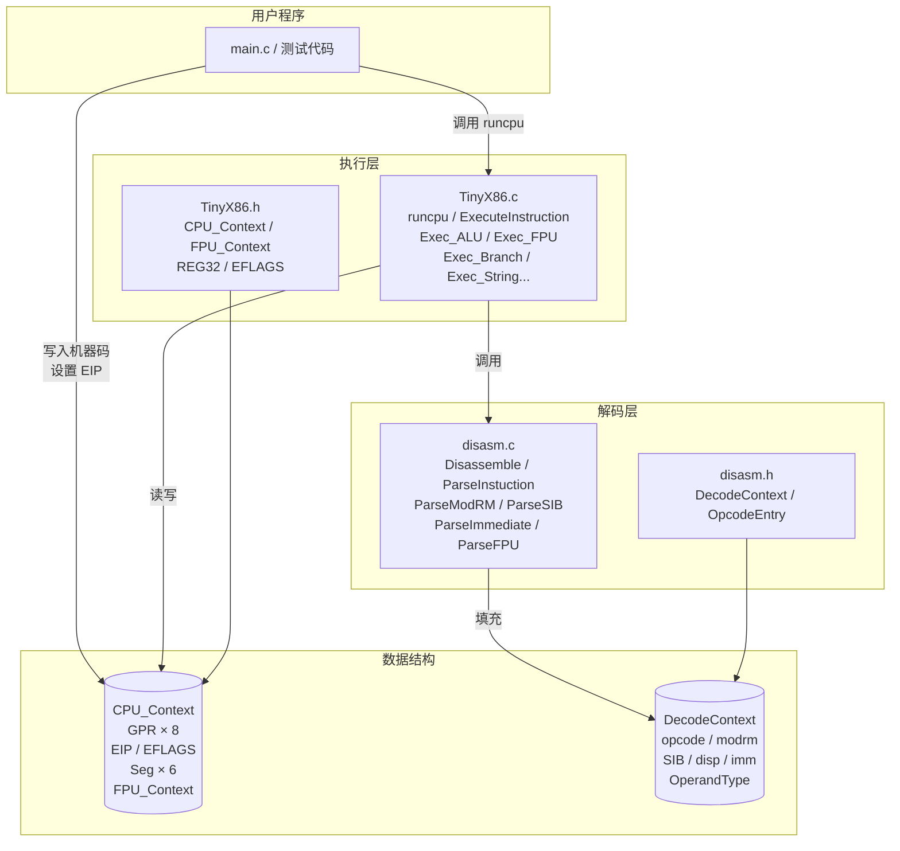
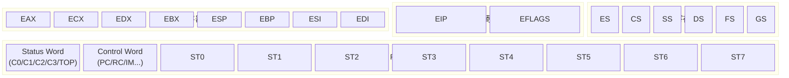
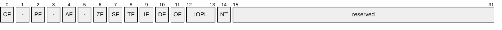
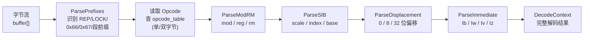
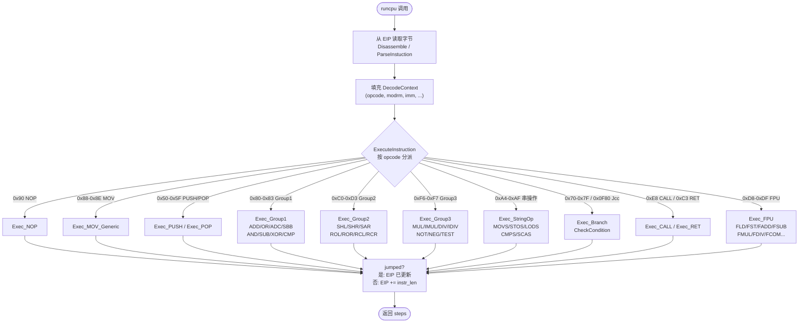
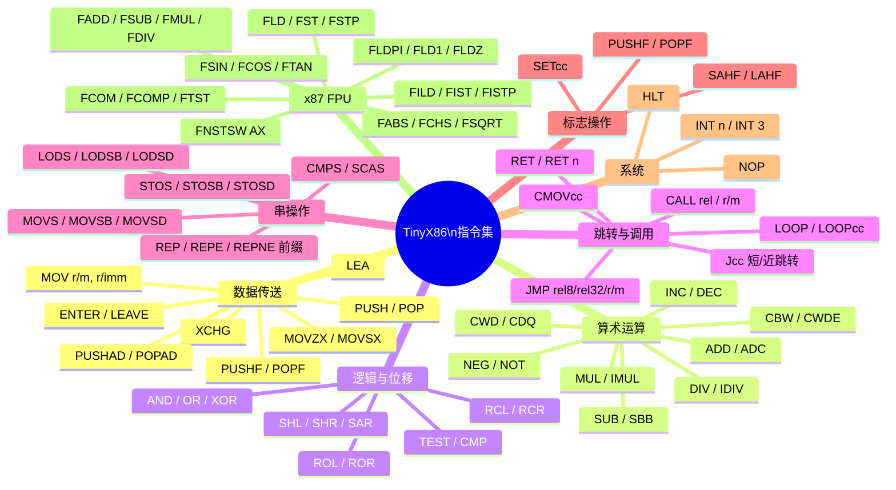
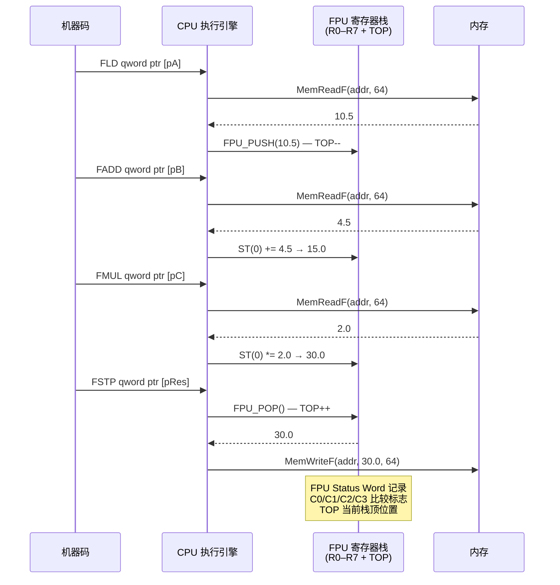

# TinyX86

一个轻量级的 x86（IA-32）CPU 模拟器，用纯 C 实现，包含完整的指令解码器与执行引擎，并支持 x87 FPU 浮点运算。

---

## 目录

- [项目简介](#项目简介)
- [模块架构](#模块架构)
- [CPU 寄存器布局](#cpu-寄存器布局)
- [指令解码流水线](#指令解码流水线)
- [指令执行流程](#指令执行流程)
- [支持的指令集](#支持的指令集)
- [FPU 子系统](#fpu-子系统)
- [快速上手](#快速上手)
- [测试](#测试)
- [文件结构](#文件结构)

---

## 项目简介

TinyX86 是一个教学/研究用途的 x86-32 CPU 模拟器，核心由两大模块组成：

| 模块 | 文件 | 职责 |
|------|------|------|
| 解码器 (Disassembler) | `disasm.c` / `disasm.h` | 从字节流中解析 x86 指令，填充 `DecodeContext` |
| 执行引擎 (Executor) | `TinyX86.c` / `TinyX86.h` | 根据 `DecodeContext` 执行指令，更新 `CPU_Context` |

---

## 模块架构



---

## CPU 寄存器布局



### EFLAGS 标志位



---

## 指令解码流水线



---

## 指令执行流程



---

## 支持的指令集



---

## FPU 子系统

x87 FPU 采用 8 个物理寄存器（R0–R7）加一个栈顶指针 TOP 实现寄存器栈。



---

## 快速上手

### 编译（Windows / MSVC）

使用 Visual Studio 打开 `TinyX86.slnx`，直接生成即可。

### 核心 API

```c
#include "TinyX86.h"

// 1. 初始化 CPU 上下文
CPU_Context ctx;
memset(&ctx, 0, sizeof(CPU_Context));

// 2. 准备内存与机器码
uint8_t memory[64 * 1024];
memset(memory, 0, sizeof(memory));
ctx.ESP.I32 = (uint32_t)(uintptr_t)(memory + sizeof(memory) - 1024);

uint8_t* code = memory + 0x1000;
ctx.EIP = (uint32_t)(uintptr_t)code;

// 写入机器码: MOV EAX, 42  (B8 2A 00 00 00)
code[0] = 0xB8; code[1] = 42; code[2] = 0; code[3] = 0; code[4] = 0;
code[5] = 0xC3; // RET

// 3. 压入返回地址
uint32_t magic = 0xDEADBEEF;
ctx.ESP.I32 -= 4;
*(uint32_t*)ctx.ESP.I32 = magic;

// 4. 逐步执行
while (ctx.EIP != magic) {
    runcpu(&ctx, 1);
}

printf("EAX = %u\n", ctx.EAX.I32); // 输出: EAX = 42
```

### 主要接口

| 函数 | 说明 |
|------|------|
| `runcpu(ctx, step)` | 执行 `step` 条指令，返回 0 成功 |
| `ExecuteInstruction(ctx, d_ctx)` | 执行单条已解码指令 |
| `ReadGPR(ctx, index, size)` | 读通用寄存器（8/16/32 位）|
| `WriteGPR(ctx, index, size, val)` | 写通用寄存器 |
| `GetEffectiveAddress(ctx, d_ctx)` | 计算有效地址 |
| `GetOperandValue(ctx, d_ctx, idx)` | 读操作数值 |
| `SetOperandValue(ctx, d_ctx, idx, val)` | 写操作数值 |
| `MemRead(addr, bytes)` | 读内存（1/2/4 字节）|
| `MemWrite(addr, val, bytes)` | 写内存 |
| `UpdateEFLAGS(ctx, res, dst, src, size, op)` | 更新标志位 |

---

## 测试

测试位于 `Sample-Test1/` 目录，使用 **Google Test** 框架。覆盖内容包括：

- 通用寄存器读写（`ReadWriteGprHandlesSizesAndInvalid`）
- 有效地址计算（ModRM、SIB、位移）
- 操作数读写
- ALU 运算（ADD/SUB/AND/OR/XOR/CMP）
- EFLAGS 更新（CF/ZF/OF/SF/PF）
- 移位/循环移位（Group2）
- 乘除法（Group3）
- PUSH/POP 栈操作
- 分支（Jcc、JMP、CALL、RET）
- INC/DEC
- `runcpu` 集成测试

---

## 文件结构

```
TinyX86/
├── disasm.h          # 解码数据结构与接口声明
├── disasm.c          # 指令解码实现（opcode 表、ModRM、SIB、立即数解析）
├── TinyX86.h         # CPU 上下文结构、执行接口声明
├── TinyX86.c         # 指令执行实现（ALU、FPU、跳转、串操作……）
├── main.c            # FPU 综合演示程序
├── Sample-Test1/
│   ├── test.cpp      # Google Test 单元测试
│   ├── pch.h / pch.cpp
│   └── packages.config
├── TinyX86.slnx      # Visual Studio 解决方案
└── TinyX86.vcxproj   # Visual Studio 项目文件
```
